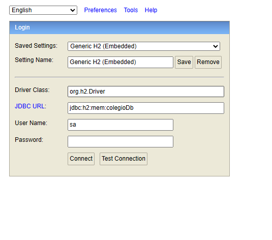
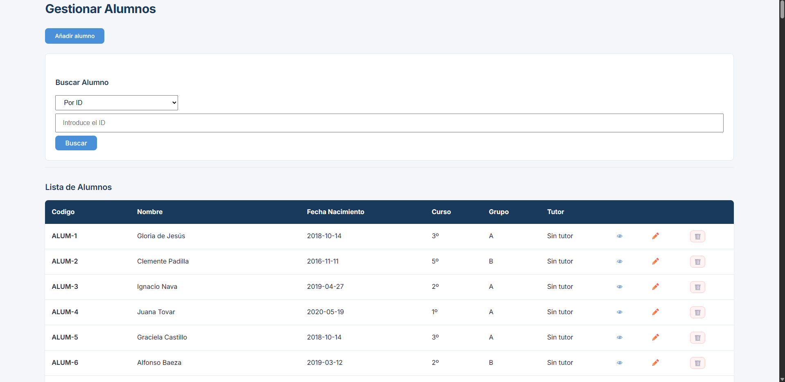
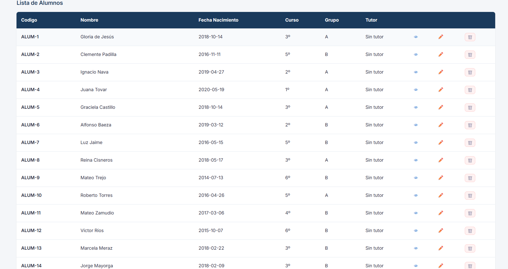
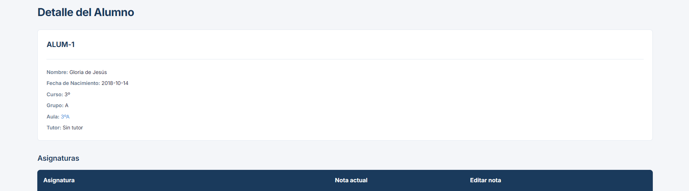
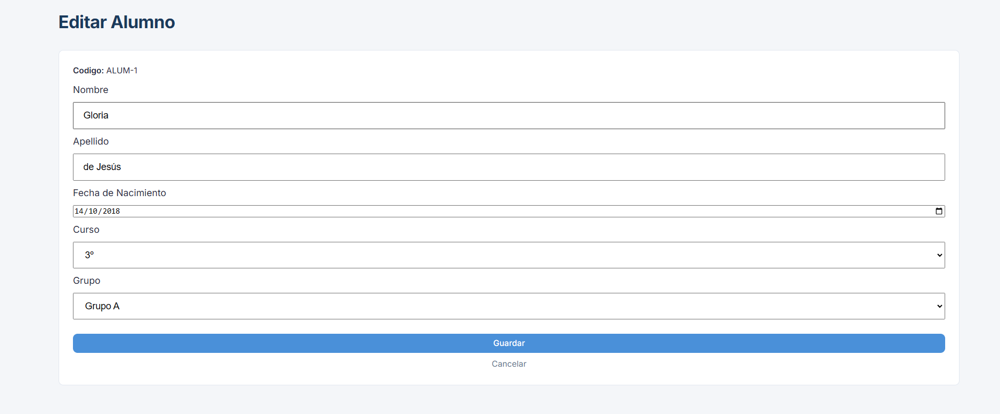

# AulaNet — Sistema de Gestión Escolar

## Descripción

**AulaNet** es una aplicación web de gestión escolar para educación primaria (1º a 6º). Permite administrar de forma completa los cuatro pilares del centro: alumnos, profesores, aulas y asignaturas, así como las relaciones entre ellos.

### Qué gestiona

**Alumnos**
Registro completo con nombre, apellido y fecha de nacimiento. Cada alumno se asigna a un aula (y por tanto a un curso). Al crearlo, el sistema genera automáticamente su código identificador (`ALUM-{id}`) y lo matricula en todas las asignaturas correspondientes a su curso.

**Profesores**
Registro con nombre, apellido, email único y especialidad docente. Las especialidades disponibles son: `GENERAL`, `EDUCACION_FISICA`, `INGLES`, `MUSICA`, `LOGOPEDA` y `RELIGION`. Cada profesor recibe un código `PROF-{id}` al ser creado.

**Aulas**
Cada aula combina un curso (1º–6º) y un grupo (A o B), generando un código único automático como `1ºA` o `3ºB`. Tiene una capacidad máxima de 30 alumnos y puede tener un profesor asignado como tutor.

**Asignaturas**
Cada asignatura pertenece a un curso concreto y tiene un número de horas semanales (1–6). Se identifica con un código `ASG-{id}`.

### Relaciones que gestiona

- Un alumno pertenece a un aula y está matriculado en las asignaturas de su curso. Cada matrícula (`MTR-{id}`) almacena la nota del alumno en esa asignatura.
- Un profesor puede impartir varias asignaturas, y una asignatura puede ser impartida por varios profesores. Cada relación almacena las horas semanales dedicadas.
- Un aula puede tener un profesor tutor, que se puede asignar y eliminar de forma independiente.

### Comportamiento automático al arrancar

Al iniciar la aplicación se carga una base de datos de prueba completa en el siguiente orden: profesores → aulas → alumnos → asignaturas → relaciones profesor-asignatura → matrículas alumno-asignatura.

### Tecnología

Backend en **Spring Boot** con base de datos **H2 en memoria** y frontend en **HTML/CSS/JavaScript**, sin frameworks. 

### Flujo

**CLIENTE** (Navegador)  -->  **CONTROLLER**    -->     **SERVICE**    -->    **REPOSITORY**    -->     **BASE DE DATOS H2**           


## Requisitos del sistema

| Herramienta | Versión  |
|-------------|----------|
| Java (JDK)  | 17       |
| Maven       | 3.8      |


---

## Ejecutar


```bash
cd colegio
```

```bash
mvn spring-boot:run
```

La aplicación arranca en `http://localhost:8080`.

### Ejecutar los tests

```bash
mvn test
```

---

## Acceso a la consola H2

Con la aplicación en marcha:

- **URL**: `http://localhost:8080/h2-console`
- **JDBC URL:** `jdbc:h2:mem:testdb`
- **Usuario:** `sa`
- **Contraseña:** *(vacia)*

---



## Estructura del proyecto

### Backend — `src/main/java/com/colegio/`

#### `config/`
Configuracion del proyercto.
```
config/
├── InicializadorConfig.java
└── ManejoErrores.java
```

#### `model/`
Entidades JPA que se mapean a tablas en la base de datos. Cada entidad tiene sus reglas mediante anotaciones (`nullable`, `unique`). Los métodos `@Transient` calculan valores sin persistirlos.

```
model/
├── Alumno.java
├── Asignatura.java
├── Aula.java
├── Profesor.java
├── AlumnoAsignatura.java      # Relación N:M matricula
├── ProfesorAsignatura.java    # Relación N:M impartir
├── Curso.java                 # Enum: PRIMERO-SEXTO
├── Grupo.java                 # Enum: grupos A, B
└── Especialidad.java          # Enum: especialidades dee los docentes
```

#### `repository/`
Interfaces que extienden `JpaRepository`. Declaran las consultas necesarias mediante nombres de metodo derivados que Spring Data JPA traduce a SQL automaticamente. No contienen logica.
```
repository/
├── AlumnoRepository.java
├── AsignaturaRepository.java
├── AulaRepository.java
├── ProfesorRepository.java
├── AlumnoAsignaturaRepository.java
└── ProfesorAsignaturaRepository.java
```

#### `service/`
Logica de negocio. Valida los datos de entrada, genera los codigos identificadores (`ALUM-`, `PROF-`, `ASG-`, `MTR-`), aplica las reglas (comopor ejemplo, matricular automáticamente a un alumno en todas las asignaturas de su curso al crearlo) y lanza `RuntimeException` cuando alguna restriccion no se cumple.

```
service/
├── AlumnoService.java
├── AsignaturaService.java
├── AulaService.java
├── ProfesorService.java
├── AlumnoAsignaturaService.java
└── ProfesorAsignaturaService.java
```

#### `util/`
Constantes con los prefijos de los codigos y los inicializadores de datos. `DbInitializater` mantiene el orden de ejecucion de los inicializadores profesores → aulas → alumnos → asignaturas → relaciones profesor-asignatura → matrículas.

```
util/
├── Constantes.java
├── DbInitializater.java
├── AlumnoInitializater.java
├── AulaInitializater.java
├── Asignaturainitializater.java
├── Profesorinitializater.java
├── Alumnoasignaturainitializater.java
└── Profesorasignaturainitializater.java
```

#### `controller/`
Capa REST. Recibe las peticiones HTTP, delega en el servicio correspondiente y devuelve la respuesta. No contiene logica de negocio. Cada controlador mapea un recurso bajo `/api/v1`.

```
controller/
├── AlumnoController.java
├── AsignaturaController.java
├── AulaController.java
├── ProfesorController.java
├── AlumnoAsignaturaController.java
├── ProfesorAsignaturaController.java
└── StatusController.java
```
---


#### `js/api/`
Dispone de una funcion por cada endpoint de la API REST. Encapsulan las llamadas `fetch` con la URL base, el metodo HTTP y el cuerpo

```
js/api/
├── alumnoApi.js
├── alumnoAsignaturaApi.js
├── asignaturaApi.js
├── aulaApi.js
├── profesorApi.js
└── profesorAsignaturaApi.js
```

#### `js/components/`
Tarjetas de entidades y la barra de navegacion.

```
js/components/
├── alumnoComponente.js
├── asignaturaComponente.js
├── aulaComponente.js
├── profesorComponente.js
└── navbar.js
```

#### `js/config/`
Define la URL base de la API (`http://localhost:8080/api/v1`).

```
js/config/
└── config.js
```

#### `js/pages/`
Logica de cada pagina

```
js/pages/
├── inicio.js
├── menuAlumno.js        crearAlumno.js        detalleAlumno.js   editarAlumno.js
├── menuProfesor.js      crearProfesor.js      detalleProfesor.js 
 editarProfesor.js
├── menuAsignatura.js    detalleAsignatura.js
└── menuAula.js          detalleAula.js
```

#### `js/utils/`
Funciones auxiliares: manejo de errores HTTP, constantes de frontend.

js/utils/
├── apiUtils.js
└── constantes.js

## `css/`
Estilos divididos segun lo que se va amodificar: `hero.css` para la portada, `navbar.css` para la barra de navegacion y `pages.css` para las páginas de listado y detalle.

#### `HTML`
Cada pagina tiene su propio archivo `.html` que carga los scripts correspondientes de `pages/` y todo lo necesario.


### Tests — `src/test/java/com/colegio/`
Tests unitarios de la capa de servicio. Verifican la lógica de negocio de `AlumnoService`, `AsignaturaService` y `ProfesorService` de forma aislada, sin levantar el contexto de Spring ni la base de datos.

```
├── AlumnoServiceTest.java
├── AsignaturaServiceTest.java
└── PorfesorServiceTest.java
```

---

## Modelo de dominio

### Entidades principales

| Entidad | Tabla | Código generado |
|---------|-------|-----------------|
| `Alumno` | `alumnos` | `ALUM-{id}` |
| `Profesor` | `profesores` | `PROF-{id}` |
| `Asignatura` | `asignaturas` | `ASG-{id}` |
| `Aula` | `aulas` | `{curso}{grupo}` (ej. `1ºA`) |

### Relaciones

**N:M **

| Entidad | Tabla | Participantes | Atributo  | Código |
|---------|-------|--------------|----------------|--------|
| `AlumnoAsignatura` | `alumno_asignatura` | `Alumno` ↔ `Asignatura` | `nota` (double) | `MTR-{id}` |
| `ProfesorAsignatura` | `profesor_asignatura` | `Profesor` ↔ `Asignatura` | `horasSemanales` (int) | — |

**N:1**

| Entidad hijo | Entidad padre | Columna FK | Obligatoria |
|-------------|--------------|------------|-------------|
| `Alumno` | `Aula` | `aula_id` | Sí (`nullable=false`) |

**1:1**

| Entidad | Entidad relacionada | Columna FK | Obligatoria |
|---------|-------------------|------------|-------------|
| `Aula` | `Profesor` (tutor) | `tutor_id` | No (`nullable=true`) |

### Enumeraciones

- **`Curso`**: `PRIMERO` - `SEXTO` — etiquetas `1º` - `6º`
- **`Grupo`**: grupos dentro de un curso (A, B)
- **`Especialidad`**: especialidad docente del profesor

---

## Rutas de la API

Base: `http://localhost:8080/api/v1`

### Estado

| Método | Ruta | Descripción |
|--------|------|-------------|
| `GET` | `/status` | Comprueba que el servidor responde |

---

### Alumnos — `/alumnos`

| Método | Ruta | Descripción |
|--------|------|-------------|
| `GET` | `/alumnos` | Listar todos |
| `GET` | `/alumnos/{id}` | Obtener por id |
| `GET` | `/alumnos/fecha/{fecha}` | Filtrar por fecha de nacimiento (`yyyy-MM-dd`) |
| `GET` | `/alumnos/aula/{aulaId}` | Filtrar por id de aula |
| `GET` | `/alumnos/aula/codigo/{codigo}` | Filtrar por código de aula (ej. `1ºA`) |
| `GET` | `/alumnos/curso/{curso}` | Filtrar por curso (ej. `PRIMERO`) |
| `GET` | `/alumnos/buscar/{nombre}` | Buscar por nombre (contiene) |
| `GET` | `/alumnos/buscar/{nombre}/{apellido}` | Buscar por nombre y apellido |
| `POST` | `/alumnos` | Crear alumno |
| `PUT` | `/alumnos/{id}` | Actualizar alumno |
| `DELETE` | `/alumnos/{id}` | Eliminar alumno |

---

### Profesores — `/profesores`

| Método | Ruta | Descripción |
|--------|------|-------------|
| `GET` | `/profesores` | Listar todos |
| `GET` | `/profesores/{id}` | Obtener por id |
| `GET` | `/profesores/email/{email}` | Obtener por email |
| `GET` | `/profesores/especialidad/{especialidad}` | Filtrar por especialidad |
| `GET` | `/profesores/buscar/{nombre}` | Buscar por nombre (contiene) |
| `GET` | `/profesores/buscar/{nombre}/{apellido}` | Buscar por nombre y apellido |
| `POST` | `/profesores` | Crear profesor |
| `PUT` | `/profesores/{id}` | Actualizar profesor |
| `DELETE` | `/profesores/{id}` | Eliminar profesor |

---

### Asignaturas — `/asignaturas`

| Método | Ruta | Descripción |
|--------|------|-------------|
| `GET` | `/asignaturas` | Listar todas |
| `GET` | `/asignaturas/{id}` | Obtener por id |
| `GET` | `/asignaturas/curso/{curso}` | Filtrar por curso (ej. `1º`) |
| `POST` | `/asignaturas` | Crear asignatura |
| `PUT` | `/asignaturas/{id}` | Actualizar asignatura |
| `DELETE` | `/asignaturas/{id}` | Eliminar asignatura |

---

### Aulas — `/aulas`

| Método | Ruta | Descripción |
|--------|------|-------------|
| `GET` | `/aulas` | Listar todas |
| `GET` | `/aulas/{id}` | Obtener por id |
| `GET` | `/aulas/codigo/{codigo}` | Obtener por código (ej. `1ºA`) |
| `GET` | `/aulas/curso/{curso}` | Filtrar por curso |
| `GET` | `/aulas/disponibles` | Listar aulas con plazas libres |
| `GET` | `/aulas/{id}/alumnos/count` | Contar alumnos del aula |
| `POST` | `/aulas` | Crear aula |
| `PUT` | `/aulas/{id}` | Actualizar aula |
| `PUT` | `/aulas/{aulaId}/tutor/{profesorId}` | Asignar tutor al aula |
| `DELETE` | `/aulas/{id}` | Eliminar aula |
| `DELETE` | `/aulas/{aulaId}/tutor` | Eliminar tutor del aula |

---

### Matrículas (Alumno–Asignatura) — `/alumno-asignatura`

| Método | Ruta | Descripción |
|--------|------|-------------|
| `GET` | `/alumno-asignatura` | Listar todas |
| `GET` | `/alumno-asignatura/{id}` | Obtener por id |
| `GET` | `/alumno-asignatura/alumno/{alumnoId}` | Matrículas de un alumno |
| `GET` | `/alumno-asignatura/asignatura/{asignaturaId}` | Matrículas de una asignatura |
| `POST` | `/alumno-asignatura` | Crear matrícula |
| `PUT` | `/alumno-asignatura/{id}` | Actualizar nota |
| `DELETE` | `/alumno-asignatura/{id}` | Eliminar matrícula |

---

### Relaciones Profesor–Asignatura — `/profesor-asignatura`

| Método | Ruta | Descripción |
|--------|------|-------------|
| `GET` | `/profesor-asignatura` | Listar todas |
| `GET` | `/profesor-asignatura/{id}` | Obtener por id |
| `GET` | `/profesor-asignatura/profesor/{profesorId}` | Relaciones de un profesor |
| `GET` | `/profesor-asignatura/asignatura/{asignaturaId}` | Relaciones de una asignatura |
| `GET` | `/profesor-asignatura/aula/{aulaId}` | Relaciones del curso del aula |
| `POST` | `/profesor-asignatura` | Crear relación |
| `PUT` | `/profesor-asignatura/{id}` | Actualizar relación |
| `DELETE` | `/profesor-asignatura/{id}` | Eliminar relación |

---

## Frontend

Los archivos estaticos estan en `src/main/resources/static/`.

Acceso: `http://localhost:8080/index.html`

Páginas disponibles:

| Página | Ruta |
|--------|------|
| Inicio | `/index.html` |
| Alumnos | `/menuAlumno.html` |
| Detalle alumno | `/detalleAlumno.html` |
| Crear alumno | `/crearAlumno.html` |
| Editar alumno | `/editarAlumno.html` |
| Profesores | `/menuProfesor.html` |
| Detalle profesor | `/detalleProfesor.html` |
| Crear profesor | `/crearProfesor.html` |
| Editar profesor | `/editarProfesor.html` |
| Asignaturas | `/menuAsignatura.html` |
| Detalle asignatura | `/detalleAsignatura.html` |
| Aulas | `/menuAula.html` |
| Detalle aula | `/detalleAula.html` |


---

### Capturas
Inicio De Alumnos


Listado de Alumnos 


Detalle de Alumno


Editar Alumno


## Datos iniciales

Al arrancar, los inicializadores cargan automáticamente:

- Aulas por curso y grupo
- Profesores con especialidad asignada
- Asignaturas por curso
- Alumnos distribuidos en aulas
- Matrículas alumno–asignatura
- Relaciones profesor–asignatura

---

## Mejoras futuras

**Datos ampliados de entidades**
```
Las entidades Alumno y Profesor actualmente almacenan los campos mínimos necesarios. Se contemplan campos adicionales como dirección, teléfono de contacto, foto de perfil, fecha de incorporación al centro y datos del tutor legal en el caso del alumno.
```

**Expediente académico del alumno**
```
Historial completo por curso escolar: notas por evaluación, faltas de asistencia, observaciones del tutor y progresión entre cursos. Permitiría generar un boletín de notas exportable en PDF o excel
```

**Ordenacion y filtrado en los listados**
```
Botones en las cabeceras de las tablas del frontend para ordenar los listados de alumnos, profesores y asignaturas por cualquier columna (nombre, curso, nota media, etc.) de forma ascendente y descendente, sin recargar la página.
```

**Chatbot con IA integrado**
```
Asistente conversacional embebido en la interfaz que permita realizar consultas en lenguaje natural sobre los datos del centro: "¿Cuántos alumnos hay en 3ºA?", "¿Qué asignaturas imparte el profesor X?", "Lista los alumnos con nota media inferior a 5". El chatbot consultaría la API REST existente para responder con datos reales.
```

## Autor

Guillermo Rafael Jiménez Muñoz
1º DAM Stem Granada